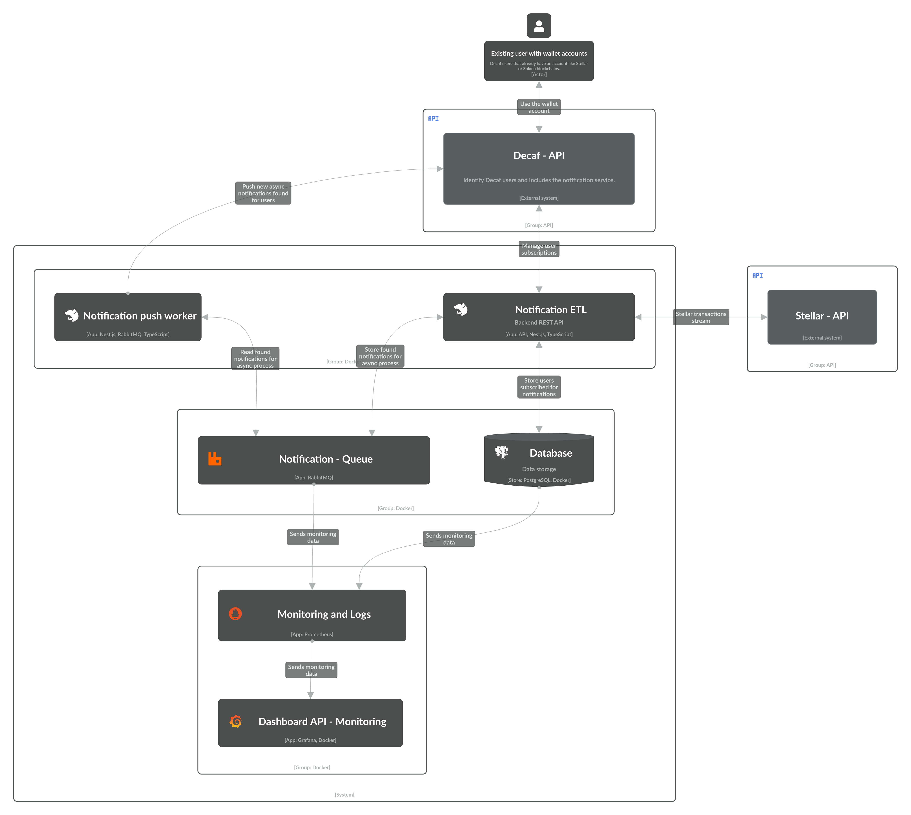
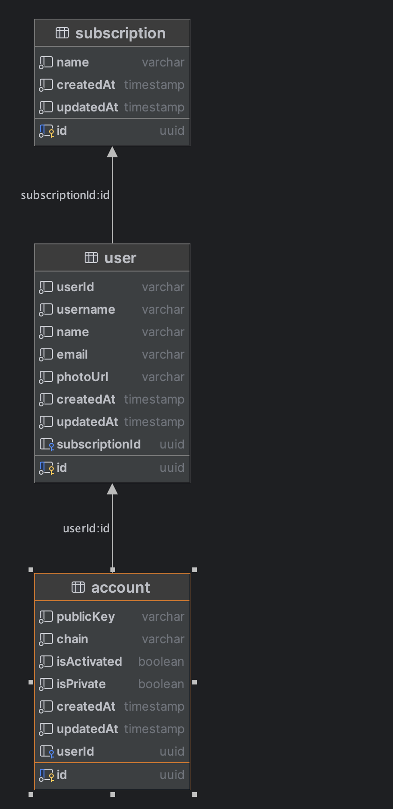
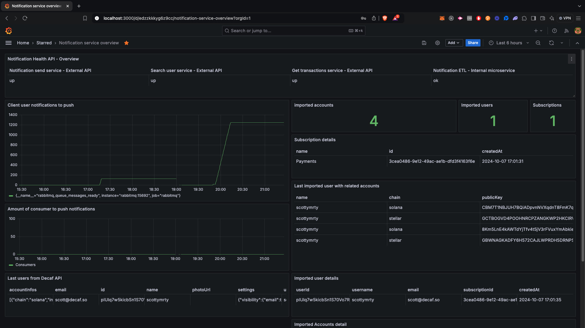

# Notification ETL service - Microservice

This project is a microservice that listens for Stellar transactions and imports Decaf users to notify them about
transactions associated with their accounts.
Also delegates the notification to
the [Notification worker service](https://github.com/IsmaelTerreno/notification-worker-service) via RabbitMQ messages.

# Tutorial videos for the project:

- [Part 1 - Microservice Design Explanation 🎥 ](https://www.loom.com/share/2cc4d31f67934be1bd0268d18885249d?sid=7890692c-2001-4642-afa3-4dc6f732aab1)
- [Part 2 - How to run the Microservices with Docker 🎥 ](https://www.loom.com/share/2cc4d31f67934be1bd0268d18885249d?sid=7890692c-2001-4642-afa3-4dc6f732aab1)
- [Part 3 - How to test the Microservices and use the monitoring tools 🎥 ](https://www.loom.com/share/2cc4d31f67934be1bd0268d18885249d?sid=7890692c-2001-4642-afa3-4dc6f732aab1)


## Planned Architecture:



PLEASE! Navigate through
the [following public link to access the planned architecture](https://s.icepanel.io/uYg8sIP5nHttWN/9CSh) for
the Stellar Notification microservice system. Where you can see and interact with the architecture diagram, also there
is a visual workflow to see the interaction on the bottom left you will see an "Import users from Decaf and transaction
from Stellar to notify users" flow to see interaction animations.

## Database model used in the architecture:



This implementation is based on the coding task mentioned down below.

## How to run the project with Docker

### Prerequisites

- Docker

### Requirements

#### 1) Run the following command to give permissions to the shell scripts:

```bash
chmod +x ./docker/rabbit-mq-script-config/init-queue.sh
```

#### 2) Run the following two commands to start the project and download image dependencies with docker-compose:

To start the microservice Docker services, run the following command:

```bash
cd docker && docker-compose -f docker-compose-microservice.yml up -d
```
To start the monitoring Docker services, run the following command:

```bash
cd docker && docker-compose -f docker-compose-monitoring.yml up -d
```

#### 3) Wait for approximately 10-20 seconds for the services to start, then you will be able to access the following local services:

#### Microservice core services:

- [RabbitMQ Management](http://localhost:15672). User: `notification_service_api_mq`, Password:
  `notification_service_api_mq`
- [Notification ETL Service](http://localhost:3090/health)

#### Mock Decaf API services:

- [Mock Search users - Decaf API](http://localhost:1080/searchUserProfile)
- [Mock Notification send - Decaf API](http://localhost:1080/notifications/send)

#### Monitoring services:

- [Grafana Monitoring dashboard](http://localhost:3000)
- [Prometheus Monitoring](http://localhost:9090)

You can check the container status with the following command, in the meantime, the services are starting:

```bash
docker ps
```

#### 4. Go to the [Notification service overview](http://localhost:3000/d/edzzkkkyg6z9cc/notification-service-overview?orgId=1)

#### Login with the following credentials.

- **User**: admin
- **Password**: admin123

Then you will see the following dashboard:



4. Run the related
   microservice [Notification worker service](https://github.com/IsmaelTerreno/notification-worker-service) to work
   together with the Notification ETL service. Note that the Notification worker service is a separate project but this
   microservice is ok to run ok in the meantime.

## Coding Task: Create a Stellar Notification System for Decaf Wallet

Objective: Develop a microservice-based notification system that monitors Stellar transactions and notifies Decaf users
of relevant activities.

### Context:

Right now in the Decaf wallet, when you receive a Solana transaction you will be notified. But on stellar we are yet to
have this, due to the unavailability of third party indexing and webhook services. We need your help!

Create a system to notify our users on Stellar. If you have any suggestions outside of the guidelines they are more than
welcome. Your code will actually be implemented if we love it!


## Requirements:

- Parse the Stellar transactions
  stream → https://developers.stellar.org/docs/data/horizon/api-reference/list-all-transactions
- Identify Decaf users utilizing the Decaf Users API
- Notify the notification service when a Decaf user is found
- Implement the solution in a Microservice architecture
- Use TypeScript for implementation (if not using TypeScript, provide detailed comments and documentation)
- Note: All internal Decaf services endpoints should be mocked! i.e. Users Api and Notification endpoint

## Technical Specifications:

1. Create a microservice to
   handle [Stellar transaction stream parsing](https://developers.stellar.org/docs/data/horizon/api-reference/list-all-transactions)
2. Implement a service to interact with the Decaf Users API
    1. Example response from the users search api:
       url: https://staging.decafapi.com/searchUserProfile?text=GCTBOGVD4POOHNRCPZANGKWP2HKCIRVA6ISWTKXURJP4N5QCLZRYSAAM

        ```json
        [
          {
            "id": "pIUlq7w5kicbSn1S70Vo7R7LzA13",
            "username": "scottymrty",
            "name": "scottymrty",
            "email": "scott@decaf.so",
            "photoUrl": "",
            "accountInfos": [
              {
                "publicKey": "CBM7T1NBJUH7BQiADpvnNVXqdnT8FmK7quJUJaUTEEG8",
                "chain": "solana",
                "index": 0,
                "isActivated": true,
                "isPrivate": false
              },
              {
                "publicKey": "GCTBOGVD4POOHNRCPZANGKWP2HKCIRVA6ISWTKXURJP4N5QCLZRYSAAM",
                "chain": "stellar",
                "index": 0,
                "isActivated": true,
                "isPrivate": false
              },
              {
                "publicKey": "8Km5LnE4kAWTdYjTfv4t5jV3rFVuxYmAbkiezrjqs1vp",
                "chain": "solana",
                "index": 1,
                "isActivated": true,
                "isPrivate": false
              },
              {
                "publicKey": "GBWNAGKADFY6H572CAJLWPRDH5DRNPSNMCVQEWYAAYVMH2K7TZVQCSFU",
                "chain": "stellar",
                "index": 1,
                "isActivated": true,
                "isPrivate": false
              }
            ],
            "settings": {
              "visibility": {
                "email": true,
                "name": true,
                "profilePhoto": true
              }
            }
          }
        ]
        ```

3. Develop a notification service to process and send notifications to our “notifications service”
    1. Structure of notification service request

    ```json
    # Send Notifications API
    
    ## Endpoint
    POST /notifications/send
    
    ## Headers
    - `Content-Type: application/json`
    - `Authorization: <NOTIFICATIONS_API_KEY>`
    
    ## Request Body
    ```json
    {
      "userIds": ["user1", "user2", "user3"],
      "notification": {
        "title": "New Message",
        "body": "You have a new message!",
        "data": {
          "messageId": "12345",
          "sender": "John Doe"
        }
      }
    }
    ```

   ### Fields
    - `userIds` (required): An array of user IDs to send the notification to.
    - `notification` (required):
        - `title` (required): The title of the notification.
        - `body` (optional): The body text of the notification.
        - `data` (optional): Any additional JSON data to be sent with the notification.

   ## Notes
    - The `NOTIFICATIONS_API_KEY` must be included in the Authorization header for the request to be authenticated.
    - The `fcmToken` and `userId` are not included in the request body as they are handled internally by the server.
    - The server will retrieve the necessary FCM tokens for each user ID provided.

   ## Example cURL Request
    ```bash
    curl -X POST https://staging.decafapi.com/notifications/send \
      -H "Content-Type: application/json" \
      -H "Authorization: your-notifications-api-key" \
      -d '{
        "userIds": ["user1", "user2"],
        "notification": {
          "title": "New Feature",
          "body": "Check out our latest update!",
          "data": {
            "featureId": "789",
            "version": "2.0"
          }
        }
      }'
    ```

4. Ensure proper error handling and logging throughout the system
5. (Bonus) Implement tests for each component

## Deliverables:

- Source code for all microservices
- Documentation explaining the architecture and how to run the system
- If not using TypeScript, provide comprehensive comments and additional documentation

## Evaluation Criteria:

- Code quality and organization
- Proper implementation of microservice architecture
- Efficiency of the Stellar transaction parsing
- Accuracy in identifying Decaf users
- Reliability of the notification system
- Quality of documentation and comments
- Test coverage and quality
- Creativity on design and scalability/iterability on future ideas
